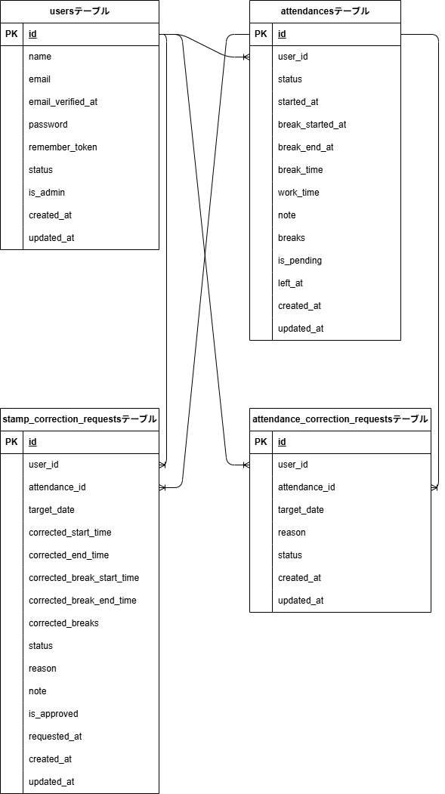

# 勤怠管理アプリ

一般ユーザーが出勤・退勤・休憩を打刻し、
管理者が勤怠一覧の確認や打刻修正申請の承認を行える勤怠管理アプリです。

## 主な機能

### 一般ユーザー

- 会員登録 / ログイン
- 出勤・退勤・休憩の打刻
- 月別勤怠一覧の確認
- 勤怠詳細の確認
- 打刻修正申請

### 管理者

- 管理者ログイン
- 全ユーザーの勤怠一覧確認
- スタッフ別勤怠詳細確認
- 打刻修正申請の承認
- CSV エクスポート

## 環境構築

**Docker ビルド**

1. `git clone https://github.com/KOTOHA240/attendance-management.git`
2. DockerDesktop アプリを立ち上げる
3. `docker-compose up -d --build`

**Laravel 環境構築**

1. `docker-compose exec php bash`
2. `composer install`
3. 「.env.example」ファイルを 「.env」ファイルに命名を変更。または、新しく.env ファイルを作成
4. .env に以下の環境変数を追加

```text
DB_CONNECTION=mysql
DB_HOST=mysql
DB_PORT=3306
DB_DATABASE=laravel_db
DB_USERNAME=laravel_user
DB_PASSWORD=laravel_pass
```

5. アプリケーションキーの作成

```bash
php artisan key:generate
```

6. マイグレーションの実行

```bash
php artisan migrate
```

7. シーディングの実行

```bash
php artisan db:seed
```

## 使用技術

- PHP8.2.29
- Laravel8.83.29
- MySQL8.0.26
- Docker / Docker Compose

## ER 図

本アプリで使用しているデータベース構成を示した ER 図です。



## テストアカウント

name: 管理者
email: admin@example.com
password: password1234

## URL

- 開発環境：http://localhost/
- 管理者ログイン: http://localhost/admin/login
- phpMyAdmin:：http://localhost:8080/

## 注意事項

- Docker コンテナ起動後、必ず `composer install` を実行してください
- 初回起動時は `php artisan migrate --seed` を実行してください
- `.env` ファイルが存在しない場合、`.env.example` をコピーして作成してください
